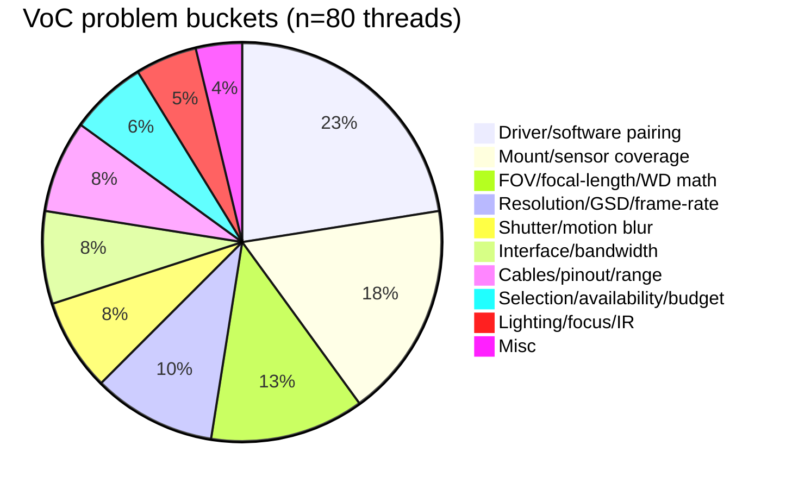
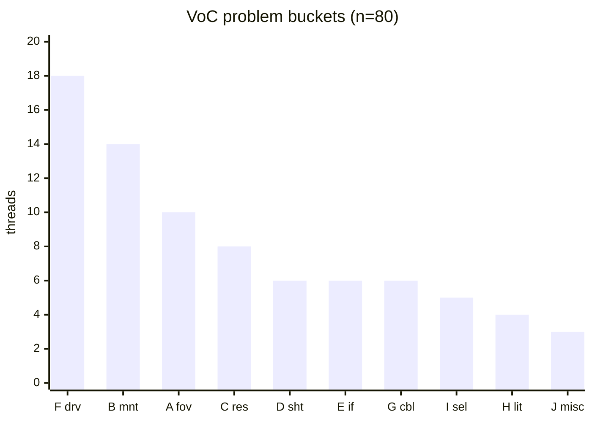

# VoC Problem-Bucket Graph — 80 threads, 9 buckets + Misc

Classified 2026-09-26 from every item in `data/voice-of-customer/`
(`reddit` 12 + `nvidia-arducam` 10 + `machine-vision-stack` 10 +
`rpi-supplement` 10 + `reddit-supplement` 10 + `vendor-supplement` 9 +
`sharpcap-supplement` 9 + `imagesc-supplement` 10 = **80**).
Each item sits in exactly one bucket (single-label rule; ties broken by
the asker's primary question). Vendor KB/app-note items are classified by
the buyer pain they answer, not by their format.

Bucket short codes used below and in `problem-graph.html`:
A = FOV/focal-length/WD math · B = mount/coverage/adapters ·
C = resolution/GSD/frame-rate · D = shutter/motion ·
E = interface/bandwidth/networking · F = driver/software pairing ·
G = cables/pinout/range · H = lighting/focus/IR ·
I = selection/availability/budget · J = Misc.

## Count table

| # | Bucket | n | Share |
|---|---|---|---|---|
| F | Driver / software pairing (Pylon, Micro-Manager, Jetson, Linux, SharpCap) | 18 | 22.5% |
| B | Lens mount / sensor coverage / adapters (C/CS/M12, image circle, back-focus) | 14 | 17.5% |
| A | FOV / focal-length / working-distance math | 10 | 12.5% |
| C | Resolution / GSD / defect-size / frame-rate (incl. ROI fps) | 8 | 10.0% |
| D | Shutter type / motion blur (global vs rolling, moving targets) | 6 | 7.5% |
| E | Interface / bandwidth / networking (USB, CSI protocol, GigE discovery) | 6 | 7.5% |
| G | Cables / extenders / pinout / range | 6 | 7.5% |
| I | Selection paralysis / availability / budget | 5 | 6.2% |
| H | Lighting / color / focus / IR | 4 | 5.0% |
| J | Misc (leftovers) | 3 | 3.8% |
| | **Total** | **80** | **100%** |

## ASCII bar chart (1 block = 1 thread)

```
F driver/software   18 ██████████████████  22.5%
B mount/coverage    14 ██████████████      17.5%
A FOV/WD math       10 ██████████          12.5%
C resolution/GSD     8 ████████            10.0%
D shutter/motion     6 ██████               7.5%
E interface/net      6 ██████               7.5%
G cables/range       6 ██████               7.5%
I selection/budget   5 █████                6.2%
H lighting/focus     4 ████                 5.0%
J misc               3 ███                  3.8%
```

## Mermaid diagram





## Per-bucket top-3 example threads

### F — Driver / software pairing (18)

- Basler Pylon Unavailable (Micro-Manager 2.0 + Pylon 7.1, first light blocked) —
  https://forum.image.sc/t/basler-pylon-unavailable/87608
- Unable to connect Basler a2A 1920-160uc PRO (works in Pylon, neither SharpCap nor FireCapture) —
  https://forums.sharpcap.co.uk/viewtopic.php?t=9278
- Arducam IMX477 driver install fails on Jetson (mountpoint error, day of reflashing) —
  https://forums.developer.nvidia.com/t/issue-installing-arducam-imx477-driver-on-jetson-runtimeerror-mountpoint-mnt-app-already-exists/332548
- Full member list: `nvidia267033, nvidia332548, arducam10210, r-embedded-1w6yys9,
  sharpcap7757, sharpcap8617, sharpcap9278, sharpcap6068, sharpcap151, sharpcap1263,
  imagesc87608, imagesc51786, imagesc60274, imagesc68660, imagesc79843, imagesc111299,
  nvidia340841, imagesc113646`

### B — Lens mount / sensor coverage / adapters (14)

- What's the difference between HQ Camera C/CS and M12 lenses? —
  https://www.reddit.com/r/raspberry_pi/comments/1g4nyka/whats_the_difference_between_hq_camera_ccs_and/
- What determines the image circle diameter? (coverage/vignetting folk knowledge) —
  https://photo.stackexchange.com/q/130699
- 16 mm telephoto C/CS adapter: wrong ring thickness silently breaks back-focus —
  https://forums.raspberrypi.com/viewtopic.php?t=391378
- Full member list: `r-raspberry_pi-1g4nyka, photo130699, photo86448, photo43451,
  arducam5545, r-raspberry_pi-12dt3jc, r-raspberry_pi-1br9mfu, r-raspberry_pi-1m0kw6a,
  rpi400640, rpi395856, rpi391378, rpi381840, basler-learning-lens-selection,
  r-computervision-1vcoeut`

### A — FOV / focal-length / working-distance math (10)

- Focal length / sensor / resolution from angle + FOV + WD (the canonical tool-shaped Q) —
  https://photo.stackexchange.com/q/135377
- Camera + lens for 10 m laser targeting of a 6 cm target (no calculator connects the three) —
  https://forums.raspberrypi.com/viewtopic.php?t=396825
- Edmund app note: the WD↔FOV↔focal-length formulas buyers need, buried in prose —
  https://www.edmundoptics.com/knowledge-center/application-notes/imaging/understanding-focal-length-and-field-of-view/
- Full member list: `r-raspberry_pi-yntdla, arducam5585, photo135377, photo132122,
  photo131213, rpi396825, rpi395080, edmund-focal-length-fov, r-raspberry_pi-12x86n0,
  basler-vision-campus-expert-tips-lens`

### C — Resolution / GSD / defect-size / frame-rate (8)

- Pixel-to-millimeter ratio from known focus (hand-derived GSD math) —
  https://forum.arducam.com/t/how-to-determine-pixel-to-millimeter-ratio-using-an-arducam-camera-with-known-focus/8102
- Image processing for automatic defect detection (resolving the defect under production light) —
  https://stackoverflow.com/q/31444235
- Basler max fps with ROI (can't tell hardware limit from hidden setting) —
  https://forums.sharpcap.co.uk/viewtopic.php?t=6139
- Full member list: `r-computervision-1vipntd, so31444235, r-computervision-1t73a6v,
  arducam8102, rpi389713, rpi393090, sharpcap6139, rpi387864`

### D — Shutter type / motion blur (6)

- Conveyor object tracking on $150–280 (rolling-shutter blur ruins detection) —
  https://www.reddit.com/r/computervision/comments/1w9nud3/camera_recommendation_for_realtime_object/
- Mono/global-shutter 120–500 FPS DIY eye tracker <$400 (intersection nearly unsearchable) —
  https://www.reddit.com/r/computervision/comments/1rpyu0s/looking_for_a_monglobalshutter_camera_120500_fps/
- Orin Nano + Pi Global Shutter Camera (IMX296) compat murk —
  https://forums.developer.nvidia.com/t/compatibility-of-jetson-orin-nano-with-raspberry-pi-global-shutter-camera-imx296/311050
- Full member list: `r-computervision-1w9nud3, r-computervision-1rpyu0s, nvidia311050,
  r-computervision-1svi4dk, imagesc114067, sharpcap6234`

### E — Interface / bandwidth / networking (6)

- 2 USB cameras not working with OpenCV (bandwidth/enumeration wall at integration) —
  https://stackoverflow.com/q/11222813
- Docker container can't access Basler GigE camera (broadcast/GVSP discovery breaks) —
  https://stackoverflow.com/q/73080768
- GigE Vision images sometimes corrupted (NIC/drivers, buyers debug the wrong layer) —
  https://forums.ni.com/t5/Machine-Vision/GigE-Vsion-images-sometimes-corrupted/td-p/2037614
- Full member list: `so11222813, so73080768, r-computervision-1w48m73,
  ni-gige-corrupted-images, teledyne-robust-gige, r-computervision-1ukff19`

### G — Cables / extenders / pinout / range (6)

- Extending a Camera Module 3 cable (gamble on extender hacks, no signal-integrity guidance) —
  https://www.reddit.com/r/raspberry_pi/comments/1uuaxmm/would_this_work_im_trying_to_extend_my_camera/
- Longer than 500 mm ribbon cable (robot head needs 800–1000 mm; MIPI limits force workarounds) —
  https://forums.raspberrypi.com/viewtopic.php?t=389366
- Teledyne: USB3 cables >5 m "less reliable" (placement silently constrains interface) —
  https://www.teledynevisionsolutions.com/support/support-center/application-note/iis/extending-the-working-distance-of-usb-3.1-cameras
- Full member list: `r-raspberry_pi-1uuaxmm, nvidia349380, r-embedded-1w6sizz,
  rpi389366, teledyne-usb3-working-distance, zwo-max-usb3-cable`

### I — Selection paralysis / availability / budget (5)

- Best low-light, wide-angle Pi camera (no authoritative parametric answer) —
  https://www.reddit.com/r/raspberry_pi/comments/1pn1abj/need_help_finding_the_best_low_light_wide_angle/
- I can't find cameras in stock (IMX273 backordered for weeks; selection needs live availability) —
  https://www.reddit.com/r/computervision/comments/1vq21dk/i_cant_find_cameras_in_stock/
- Microscope camera recommendations for brightfield (zero sample images to compare) —
  https://forum.image.sc/t/recommendations-for-microscope-cameras-for-brightfield-microscopy/109934
- Full member list: `r-raspberry_pi-1pn1abj, r-raspberry_pi-1er788d,
  r-computervision-1vq21dk, basler-lens-selecting-easy-way, imagesc109934`

### H — Lighting / color / focus / IR (4)

- Coca-Cola can recognition: algorithm vs lighting (the famous illumination lesson) —
  https://stackoverflow.com/q/10168686
- Arducam B0371 IMX519 focus to infinity (AF won't hold; no manual procedure) —
  https://www.reddit.com/r/raspberry_pi/comments/1qtmszq/how_to_set_arducam_b0371_imx519s_focus_to_infinite/
- IMX519 AK7375 autofocus/motorized focus silently broken (missing-at-purchase software feature) —
  https://forum.arducam.com/t/autofocus-and-motorized-focus-not-working-on-arducam-imx519-ak7375-cameras-on-raspberry-pi/10813
- Full member list: `r-raspberry_pi-1qtmszq, arducam10813, so10168686, imagesc93389`

## J — Misc (3 leftovers that fit no bucket)

- Compact 3D-vision setup on a robotic car (multi-domain system architecture, not one problem) —
  https://www.reddit.com/r/machinevision/comments/1o2ui9n/compact_3dvision_setup_on_a_robotic_car_testing/
- A3 Vision & Imaging hub (answers "which standard / which training", i.e. competence, not a camera pain) —
  https://www.automate.org/vision
- Temperature-sensor request + dual-gain UX + 1936-vs-1920 usable-area confusion (mixed feature/UX thread) —
  https://forums.sharpcap.co.uk/viewtopic.php?t=7821

## Full 80-item classification (audit table)

| Item | Source file | Bucket |
|---|---|---|
| r-raspberry_pi-1g4nyka | reddit.md | B |
| r-raspberry_pi-1qtmszq | reddit.md | H |
| r-raspberry_pi-yntdla | reddit.md | A |
| r-raspberry_pi-1uuaxmm | reddit.md | G |
| r-raspberry_pi-1pn1abj | reddit.md | I |
| r-computervision-1vipntd | reddit.md | C |
| r-computervision-1w9nud3 | reddit.md | D |
| r-computervision-1rpyu0s | reddit.md | D |
| r-computervision-1w48m73 | reddit.md | E |
| r-embedded-1w6yys9 | reddit.md | F |
| r-embedded-1w6sizz | reddit.md | G |
| r-machinevision-1o2ui9n | reddit.md | J |
| r-raspberry_pi-12x86n0 | reddit-supplement.md | A |
| r-raspberry_pi-12dt3jc | reddit-supplement.md | B |
| r-raspberry_pi-1br9mfu | reddit-supplement.md | B |
| r-raspberry_pi-1er788d | reddit-supplement.md | I |
| r-raspberry_pi-1m0kw6a | reddit-supplement.md | B |
| r-computervision-1svi4dk | reddit-supplement.md | D |
| r-computervision-1t73a6v | reddit-supplement.md | C |
| r-computervision-1ukff19 | reddit-supplement.md | E |
| r-computervision-1vcoeut | reddit-supplement.md | B |
| r-computervision-1vq21dk | reddit-supplement.md | I |
| nvidia267033 | nvidia-arducam.md | F |
| nvidia349380 | nvidia-arducam.md | G |
| nvidia340841 | nvidia-arducam.md | F |
| nvidia311050 | nvidia-arducam.md | D |
| nvidia332548 | nvidia-arducam.md | F |
| arducam10210 | nvidia-arducam.md | F |
| arducam10813 | nvidia-arducam.md | H |
| arducam5545 | nvidia-arducam.md | B |
| arducam8102 | nvidia-arducam.md | C |
| arducam5585 | nvidia-arducam.md | A |
| photo135377 | machine-vision-stack.md | A |
| photo132122 | machine-vision-stack.md | A |
| photo131213 | machine-vision-stack.md | A |
| photo130699 | machine-vision-stack.md | B |
| photo86448 | machine-vision-stack.md | B |
| photo43451 | machine-vision-stack.md | B |
| so11222813 | machine-vision-stack.md | E |
| so73080768 | machine-vision-stack.md | E |
| so10168686 | machine-vision-stack.md | H |
| so31444235 | machine-vision-stack.md | C |
| rpi396825 | rpi-supplement.md | A |
| rpi389713 | rpi-supplement.md | C |
| rpi381840 | rpi-supplement.md | B |
| rpi393090 | rpi-supplement.md | C |
| rpi400640 | rpi-supplement.md | B |
| rpi395856 | rpi-supplement.md | B |
| rpi391378 | rpi-supplement.md | B |
| rpi395080 | rpi-supplement.md | A |
| rpi387864 | rpi-supplement.md | C |
| rpi389366 | rpi-supplement.md | G |
| basler-lens-selecting-easy-way | vendor-supplement.md | I |
| basler-vision-campus-expert-tips-lens | vendor-supplement.md | A |
| automate-a3-vision-hub | vendor-supplement.md | J |
| basler-learning-lens-selection | vendor-supplement.md | B |
| edmund-focal-length-fov | vendor-supplement.md | A |
| teledyne-usb3-working-distance | vendor-supplement.md | G |
| zwo-max-usb3-cable | vendor-supplement.md | G |
| ni-gige-corrupted-images | vendor-supplement.md | E |
| teledyne-robust-gige | vendor-supplement.md | E |
| sharpcap7757 | sharpcap-supplement.md | F |
| sharpcap8617 | sharpcap-supplement.md | F |
| sharpcap9278 | sharpcap-supplement.md | F |
| sharpcap6068 | sharpcap-supplement.md | F |
| sharpcap151 | sharpcap-supplement.md | F |
| sharpcap6139 | sharpcap-supplement.md | C |
| sharpcap7821 | sharpcap-supplement.md | J |
| sharpcap6234 | sharpcap-supplement.md | D |
| sharpcap1263 | sharpcap-supplement.md | F |
| imagesc87608 | imagesc-supplement.md | F |
| imagesc51786 | imagesc-supplement.md | F |
| imagesc60274 | imagesc-supplement.md | F |
| imagesc68660 | imagesc-supplement.md | F |
| imagesc79843 | imagesc-supplement.md | F |
| imagesc113646 | imagesc-supplement.md | F |
| imagesc111299 | imagesc-supplement.md | F |
| imagesc93389 | imagesc-supplement.md | H |
| imagesc109934 | imagesc-supplement.md | I |
| imagesc114067 | imagesc-supplement.md | D |

## Takeaways for the selection tool

- The #1 pain (F, 22.5%) is post-purchase software enablement, not optics:
  Pylon↔Micro-Manager/SharpCap version matrices and Jetson bring-up dominate.
  A compatibility checker would address more threads than any lens calculator.
- Optics math (A+B+C ≈ 40%) is the second mass: FOV/WD calculators, mount↔sensor
  coverage checks, and GSD/defect-size estimators cover it directly.
- Physical-layer surprises (E+G ≈ 15%) surface at integration time; cable-length
  and bandwidth limits belong in selection-time warnings.
- Tie-breaking judgment calls: `nvidia311050` (GS need on Jetson → D not F),
  `r-computervision-1vipntd` (GSD-first → C not H), `arducam5545` (mount-first → B
  not H), `imagesc114067` (moving-rig motion → D not H), `rpi387864` (fps-vs-FOV
  trade → C not A).
